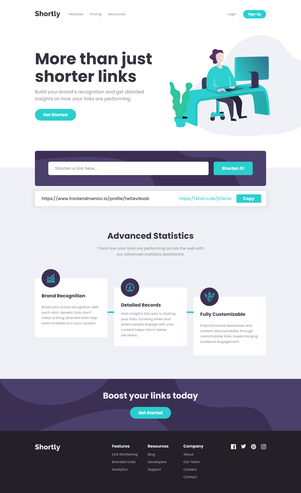

# Frontend Mentor - Shortly URL shortening API Challenge solution

This is a solution to the [Shortly URL shortening API Challenge challenge on Frontend Mentor](https://www.frontendmentor.io/challenges/url-shortening-api-landing-page-2ce3ob-G). Frontend Mentor challenges help you improve your coding skills by building realistic projects.

## Table of contents

-   [Overview](#overview)
    -   [The challenge](#the-challenge)
    -   [Screenshot](#screenshot)
    -   [Links](#links)
-   [My process](#my-process)
    -   [Built with](#built-with)
    -   [What I learned](#what-i-learned)
    -   [Continued development](#continued-development)
    -   [Useful resources](#useful-resources)
-   [Author](#author)
-   [Asknowledgements](#Asknowledgements)

## Overview

### The challenge

Users should be able to:

-   View the optimal layout for the site depending on their device's screen size
-   Shorten any valid URL
-   See a list of their shortened links, even after refreshing the browser
-   Copy the shortened link to their clipboard in a single click
-   Receive an error message when the `form` is submitted if:
    -   The `input` field is empty

### Screenshot

### Links

-   [Solution URL](https://github.com/c0dehamster/url-shortening-api)
-   [Live Site URL](https://url-shortening-api-bay.vercel.app/)

## My process

### Built with

-   Semantic HTML5 markup
-   CSS custom properties
-   Flexbox
-   CSS Grid
-   Mobile-first workflow
-   [Shrtcode API](https://shrtco.de/)
-   [Svelte](https://svelte.dev/) - JS framework
-   Typescript

### What I learned

I used this project as an opportunity to start writing in Typescript. I don't know much about it so I had to look up a lot of things such as how to type custom events, how to narrow union types, and even encountered a type checking related bug in the svelte extension for VS Code.

Apart from that, the challenge required to use a few browser APIs I had not used before, at least not in a Svelte project. I learned that the clipboard property of the global Navigator object is used to copy / paste data in the browser. I also found [a small library for working with the clipboard in svelte](https://github.com/ghostdevv/svelte-copy) but decided against using it since all I needed was a single line of code from it.

Stores turned out to be really easy to connect to the local storage. This allowes data to persist when the page is reloaded. Since with the local storage results no longer could be removed by refreshing the page, I added a Delete item button, which really should have been in the design.

Writing CSS was not much of a challenge in this project. The most difficult part of styling was getting various background images in place, especially the illustration in the hero section. I used grid areas and a relatively positioned dummy element to achieve the offset shown in the design files. Not sure if there is a way to do it with less code.

### Continued development

As far as I know, Typescript tends to be beneficial for larger and more complex projects. Therefore, I am going to continue using it even if it means writing more code and fixing bugs that would not have appeared in Javascript. Also I somewhat regret sticking to a relatively onpopular JS framework as it is harder to find information about it than about more common ones.

### Useful resources

-   [Svelte stores in localStorage](https://www.closingtags.com/svelte-stores-in-localstorage/) - an article about connecting a simple store to the local storage
-   [Typescript docs, introduction](https://www.typescriptlang.org/docs/handbook/typescript-in-5-minutes.html)

## Author

-   Frontend Mentor - [@twDevNoob](https://www.frontendmentor.io/profile/twDevNoob)

## Asknowledgements

I would like to say thanks to [@Philip-Droubi](https://www.frontendmentor.io/solutions/urlshorteningapimaster-solution-iTdbaupmje) and [@catherineisonline](https://www.frontendmentor.io/solutions/url-shortening-api-landing-page-MfZ-mjKlV) . I used their solutions as a guide to a few aspects of styling I found ambiguous.
